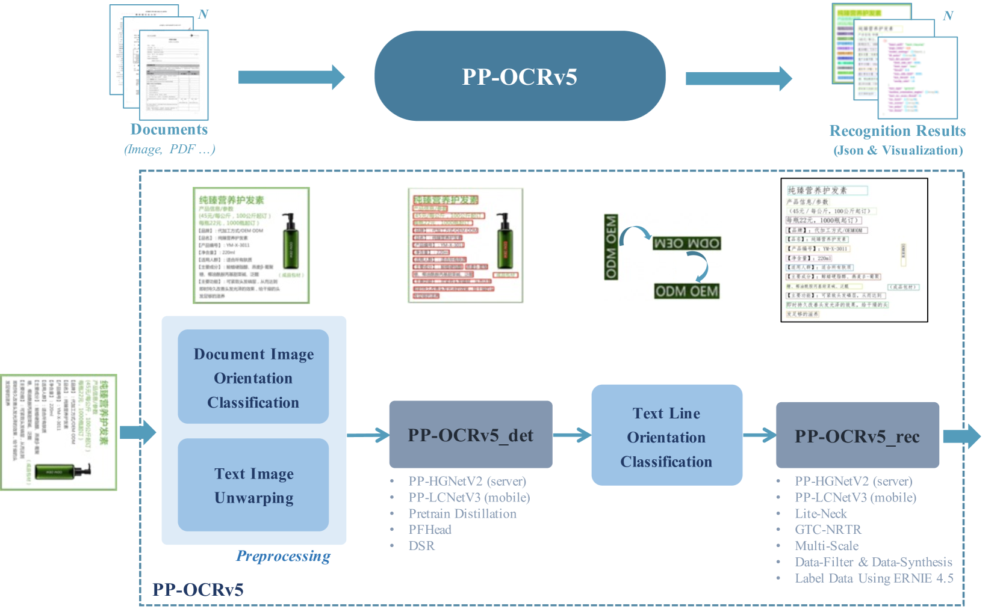
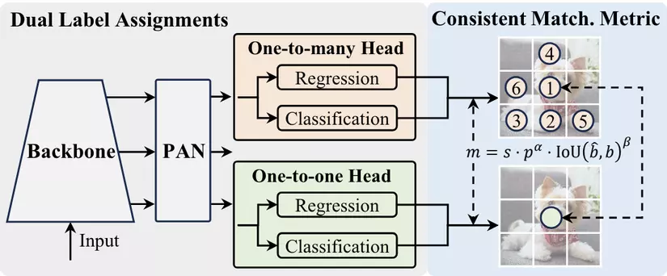

<p align="center">
  <a href="./README.md">Tiếng Việt</a> |
  <a href="./README_en.md">English</a> |
</p>

# *Deep*Doc + VietOCR - Công cụ OCR cho tiếng Việt nhanh và tiết kiệm chi phí

- [1. Giới thiệu](#1)
- [2. Kiến trúc kỹ thuật](#2)
- [3. Cài đặt và chạy thử](#3)
- [4. Tối ưu hiệu năng & Benchmark](#4)

<a name="1"></a>

## 1. Giới thiệu

Với một loạt tài liệu từ nhiều nguồn khác nhau với nhiều định dạng khác nhau và cùng với các yêu cầu truy xuất đa dạng,  một công cụ trích xuất chính xác là rất cần thiết với bất kỳ doanh nghiệp nào. Hôm nay mình sẽ giới thiệu với các bạn công cụ DeepDoc, một công cụ OCR rất nhanh và tiết kiệm chi phí khi chỉ cần chạy trên CPU. Không những vậy còn có các tính năng kèm theo là Layout Recognizer (nhận diện bố cục) và Table Structure Recognizer (nhận diện cấu trúc bảng) giúp giữ định dạng văn bản sau OCR. 

Tuy nhiên DeepDoc chưa được chuẩn hóa cho tiếng Việt nên mình đã thay VietOCR và bản ONNX vào phần Text Recognizer để có thể nhận dạng văn bảng tiếng Việt tốt hơn. Bạn cũng có thể tham khảo DeepDoc phiên bản gốc tại [đây](https://github.com/infiniflow/ragflow/blob/main/deepdoc/README.md). Thêm vào đó, DeepDoc bản chất là 1 phần xử lý dữ liệu cho luồng RAG thuộc dự án RAGFlow nên việc mình tách ra thành 1 git riêng cũng để ứng dụng có thể tùy chỉnh một cách thuận tiện hơn

<a name="2"></a>

## 2. Kiến trúc kỹ thuật
### 2.1 OCR
Phần này DeepDoc sử dụng PaddleOCR - Công cụ mã nguồn mở rất thông dụng được phát triển bởi Baidu - sau khi chuyển sang ONNX. Cơ bản thì ONNX (Open Neural Network Exchange) dạng mở cho mô hình AI, cho phép xuất – nhập mô hình giữa nhiều framework (PyTorch, TensorFlow, v.v.), giúp mô hình tương thích đa nền tảng, tối ưu tốc độ trên CPU/GPU và giảm chi phí hạ tầng khi triển khai (chúng ta sẽ không đi quá sâu về chủ đề này)

Bên DeepDoc họ không ghi rõ là sử dụng version bao nhiêu vì sau khi chuyển sang ONNX cũng khó để xác định lại. Để hiểu qua về cách hoạt động, mình sẽ tham khảo kiến trúc OCR PP-OCRv5 của bản mới nhất là PaddleOCR 3.0, bao gồm 4 phần chính:

- Image Preprocessing Module (Tiền xử lý ảnh): Cải thiện chất lượng ảnh, xử lý xoay/nghiêng bằng mô hình phân loại hướng (PP-LCNet) và unwarping (UVDoc).

- Text Detection (Phát hiện văn bản): Nâng cấp từ PP-OCRv4 nhờ backbone PP-HGNetV2, distillation từ - GOT-OCR2.0, và tăng cường dữ liệu (sinh tổng hợp, xoay, mờ, biến dạng). Giữ lại PFHead và DSR từ phiên bản trước.

- Text Line Orientation Classification (Phân loại hướng dòng chữ): Tự động phát hiện, sửa hướng dòng chữ (ngược, xoay) để chuẩn bị cho bước nhận dạng.

- Text Recognition (Nhận dạng văn bản): Kiến trúc 2 nhánh với PP-HGNetV2, huấn luyện bằng GTC-NRTR (attention) để hướng dẫn SVTR-HGNet (CTC, nhẹ, nhanh). Dữ liệu huấn luyện được tăng cường từ tài liệu, PDF, e-book, và sinh mẫu chữ viết tay.

<div align="center" style="margin-top:20px;margin-bottom:20px;">
    
</div>

Chi tiết về PP-OCRv5, bạn có thể tham khảo tài liệu chính thức tại [đây](https://arxiv.org/html/2507.05595v1).

Như đã nói bên trên, phần Recognition của Paddle đã được thay bằng VietOCR và bản ONNX để việc nhận dạng chữ tiếng Việt chính xác hơn. Về VietOCR thì đó là 1 công cụ quá phổ biến cho OCR ở Việt Nam rồi, nên mình sẽ không đi sâu, các bạn có thể tìm hiểu thêm ở [đây](https://github.com/pbcquoc/vietocr). Còn phần chuyển sang định dạng ONNX cho VietOCR thì mình tham khảo từ bài viết [này.](https://viblo.asia/p/chuyen-doi-mo-hinh-hoc-sau-ve-onnx-bWrZnz4vZxw)

### 2.2 Layout Recognizer và Table Structure Recognizer
Phần này thì DeepDoc sử dụng YOLOv10 (You Only Look Once) - cũng là 1 phương pháp object detection (phát hiện đối tượng) phổ biến - phiên bản ONNX.

Kiến trúc cơ bản gồm 3 phần chính:

- Backbone: trích xuất đặc trưng từ ảnh, dùng thiết kế nhẹ và hiệu quả (giữ lại ý tưởng từ YOLOv8 nhưng cải tiến block để giảm tính toán).

- Neck: kết hợp đa cấp độ đặc trưng (FPN/PAN cải tiến) để phát hiện tốt cả vật thể nhỏ lẫn lớn.

- Head: sử dụng Anchor-Free decoupled head (tách nhánh classification và regression), tăng độ chính xác và dễ huấn luyện.

<div align="center" style="margin-top:20px;margin-bottom:20px;">
    
</div>


Trong DeepDoc, YOLOv10 được huấn luyện để nhận dạng các loại nhãn cho phần Layout Recognizer và Table Structure Recognizer cơ bản bao phủ hầu hết các trường hợp.

Đối với Layout Recognizer, có 10 loại:
- Text (Văn bản)
- Title (Tiêu đề)
- Image (Hình ảnh)
- Image Caption (Chú thích hình ảnh)
- Table (Bảng)
- Table Caption (Chú thích bảng)
- Header (Đầu đề)
- Footer (Chân trang)
- Reference (Tài liệu tham khảo)
- Equation (Phương trình)

Đối với Table Structure Recognizer, có 5 loại:
- Column (Cột)
- Row (Hàng)
- Column header (Đầu đề cột)
- Projected row header (Đầu đề hàng được chiếu)
- Spanning cell (Ô trải dài)


Để có thể hiểu rõ hơn về YOLOv10, bạn có thể tham khảo tài liệu chính thức tại [đây](https://arxiv.org/pdf/2405.14458).

<a name="3"></a>

## 3. Cài đặt và chạy thử

Đầu tiên bạn clone git về máy:
```bash
git clone https://github.com/Annie2638/deepdoc_vietocr.git
cd deepdoc_vietocr
```
Tạo môi trường ảo và cài đặt các thư viện cần thiết (khuyến nghị **Python 3.10–3.11** để `vietocr` cài đặt trơn tru):
```bash
python -m venv .venv
# Windows:  .venv\Scripts\activate    |    Linux/macOS:  source .venv/bin/activate
pip install -r requirements.txt
```
> Nếu muốn chạy trên GPU, cài thêm bản PyTorch CUDA tương ứng (xem [phần 4](#4)).

Một số cài đặt trước khi chạy chương trình:
```bash
python t_ocr.py -h
usage: t_ocr.py [-h] --inputs INPUTS [--output_dir OUTPUT_DIR]

options:
  -h, --help            hiển thị thông báo trợ giúp này và thoát
  --inputs INPUTS       Thư mục lưu trữ hình ảnh hoặc tệp PDF hoặc đường dẫn tệp đến một hình ảnh hoặc tệp PDF duy nhất
  --output_dir OUTPUT_DIR
                        Thư mục lưu trữ hình ảnh đầu ra. Mặc định: './ocr_outputs'
```
```bash
python t_recognizer.py -h
usage: t_recognizer.py [-h] --inputs INPUTS [--output_dir OUTPUT_DIR] [--threshold THRESHOLD] [--mode {layout,tsr}]

options:
  -h, --help            hiển thị thông báo trợ giúp này và thoát
  --inputs INPUTS       Thư mục lưu trữ hình ảnh hoặc tệp PDF hoặc đường dẫn tệp đến một hình ảnh hoặc tệp PDF duy nhất
  --output_dir OUTPUT_DIR
                        Thư mục lưu trữ hình ảnh đầu ra. Mặc định: './layouts_outputs'
  --threshold THRESHOLD
                        Ngưỡng để lọc ra các phát hiện. Mặc định: 0.5
  --mode {layout,tsr}   Chế độ tác vụ: nhận dạng bố cục (layout) hoặc nhận dạng cấu trúc bảng (tsr)
```
### 3.1. OCR
Để chạy thử OCR, bạn có thể sử dụng lệnh sau:
 ```bash
python t_ocr.py --inputs=path_to_images_or_pdfs --output_dir=path_to_store_result
```
Đầu vào có thể là thư mục chứa hình ảnh hoặc PDF, hoặc một hình ảnh hoặc PDF. Đầu ra sẽ gồm 1 ảnh với các bounding box được nhận diện và 1 file txt chứa văn bản được OCR.
<div align="center" style="margin-top:20px;margin-bottom:20px;">

</div>

Mình đang để mặc định là VietOCR Seq2seq vì hiện đang chạy tương đối nhanh và chính xác. Bạn có thể đổi sang VietOCR Transformer trong module/ocr.py nhưng mình không đề xuất vì thời gian xử lý lâu hơn rất nhiều mà độ chuẩn xác không tănng lên là mấy. Nếu bạn muốn nhanh nhất có thể chuyển sang sử dụng bản ONNX bằng việc import ocr_onnx thay vì ocr nhưng độ chính xác sẽ giảm đi 1 chút.

### 3.2. Layout Recognizer (Nhận diện bố cục)
Hãy thử lệnh sau để xem kết quả Layout Recognizer:
```bash
python t_recognizer.py --inputs=path_to_images_or_pdfs --threshold=0.2 --mode=layout --output_dir=path_to_store_result
```
Đầu vào có thể là thư mục chứa hình ảnh hoặc PDF, hoặc một hình ảnh hoặc PDF. Đầu ra sẽ gồm 1 ảnh với các gán nhãn như dưới đây:
<div align="center" style="margin-top:20px;margin-bottom:20px;">

</div>

## 3.3 Table Structure Recognizer
Hãy thử lệnh sau để xem kết quả TSR.
```bash
python t_recognizer.py --inputs=path_to_images_or_pdfs --threshold=0.2 --mode=tsr --output_dir=path_to_store_result
```

Đầu vào có thể là thư mục chứa hình ảnh hoặc PDF, hoặc một hình ảnh hoặc PDF. Đầu ra sẽ là 1 ảnh với gán nhãn và 1 file markdown với nội dung bảng
<div align="center" style="margin-top:20px;margin-bottom:20px;">

</div>

<a name="4"></a>

## 4. Tối ưu hiệu năng & Benchmark

### 4.1 Nhận dạng theo lô (batched recognition)
Code gốc nhận dạng **từng dòng văn bản một** (gọi `predict` trong vòng lặp). Phần `TextRecognizer.__call__` trong `module/ocr.py` đã được sửa để dùng `predict_batch` của VietOCR — gom các dòng theo chiều rộng và giải mã cả lô trong **một lần gọi `translate()`**. Văn bản đầu ra **giữ nguyên** (không đổi độ chính xác) nhưng nhanh hơn đáng kể.

Hai biến môi trường điều khiển recognizer:
- `VIETOCR_DEVICE`: `cpu` (mặc định) hoặc `cuda:0` để chạy VietOCR trên GPU.
- `VIETOCR_BATCH`: `1` (mặc định, theo lô) hoặc `0` (từng dòng như bản gốc).

Chạy trên GPU (cần cài PyTorch bản CUDA):
```bash
# Linux/macOS
CUDA_VISIBLE_DEVICES=0 VIETOCR_DEVICE=cuda:0 python t_ocr.py --inputs=... --output_dir=...
```
```powershell
# Windows PowerShell
$env:CUDA_VISIBLE_DEVICES="0"; $env:VIETOCR_DEVICE="cuda:0"; python t_ocr.py --inputs=... --output_dir=...
```
> Phần Text Detection (ONNX) vẫn chạy CPU trừ khi cài `onnxruntime-gpu` + cuDNN, nhưng phần này chiếm thời gian không đáng kể nên không bắt buộc.

### 4.2 Kết quả benchmark
Đo trên **10 trang sách tiếng Việt** (ảnh chụp), tổng thời gian wall-clock bao gồm load model 1 lần. Cấu hình: CPU **AMD Ryzen 7 4800H**, GPU **NVIDIA GTX 1650 4GB**.

| Cấu hình | Tổng (10 trang) | Trung bình mỗi trang | So với gốc |
|---|---|---|---|
| CPU, từng dòng (gốc) | 145.8 s | 14.58 s | 1.0× |
| CPU, theo lô | 68.5 s | 6.85 s | 2.1× |
| GPU, từng dòng | 86.0 s | 8.60 s | 1.7× |
| **GPU, theo lô** | **25.9 s** | **2.59 s** | **5.6×** |

Nhận xét:
- Nhận dạng theo lô nhanh hơn **~2×** ngay cả khi chỉ chạy CPU.
- Kết hợp GPU + theo lô nhanh hơn **~5.6×** so với bản gốc, mà văn bản đầu ra không đổi.
- Nút thắt cổ chai là khâu recognition; tăng tốc đến từ việc gom lô (batching) chứ không chỉ từ GPU.

### 4.3 Tự chạy lại benchmark
Ảnh mẫu nằm trong `benchmark/images`. Chạy:
```bash
python benchmark/run_benchmark.py            # đủ 4 cấu hình (bỏ qua GPU nếu không có CUDA)
python benchmark/run_benchmark.py --device cpu
```

## Kết
Hy vọng các bạn thấy công cụ hữu ích và áp dụng được vào thực tế. Nếu có góp ý hãy để lại dưới phần bình luận. Cảm ơn các bạn đã đọc bài viết! 


## Tài liệu tham khảo
DeepDoc repo: https://github.com/infiniflow/ragflow/blob/main/deepdoc/README.md

PP-OCRv5: https://arxiv.org/html/2507.05595v1

VietOCR: https://github.com/pbcquoc/vietocr

VietOCR ONNX: https://viblo.asia/p/chuyen-doi-mo-hinh-hoc-sau-ve-onnx-bWrZnz4vZxw

YOLOv10: https://arxiv.org/pdf/2405.14458
